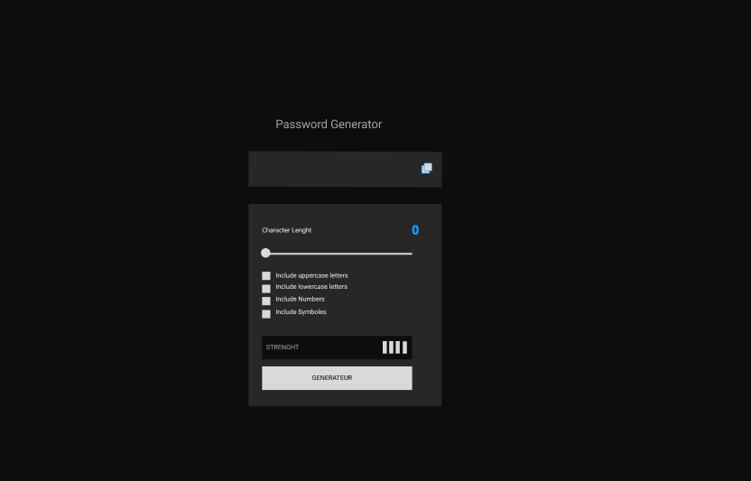

# Password Generator

## Table of Contents

- [Overview](#overview)
- [Features](#features)
- [Tech Stack](#tech-stack)
- [Deploy](#deploy)

---

## Overview

This project is a simple **Password Generator** built with **HTML, CSS, and JavaScript**.  
It allows users to create secure passwords based on selected options such as uppercase letters, lowercase letters, numbers, and symbols.  
It also includes a strength indicator and a copy-to-clipboard button.

---

## Features

- Choose password length (4–64 characters)
- Include uppercase and lowercase letters
- Include numbers
- Include special symbols
- Visual password strength indicator (Too Weak → Strong)
- Copy password to clipboard
- Dark, minimalist, responsive design

---

## Tech Stack

- **HTML5**
- **CSS3 (Flexbox)**
- **JavaScript (ES6)**
- **SVG Icon**
